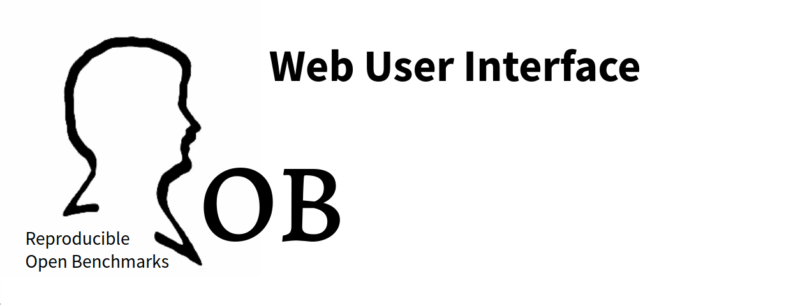
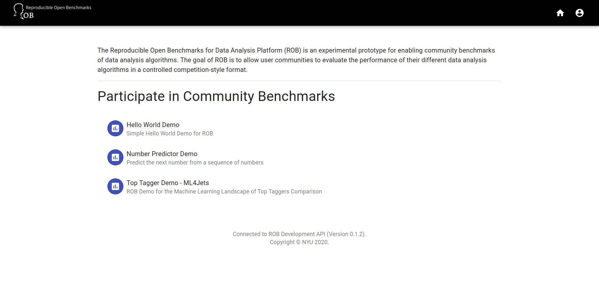
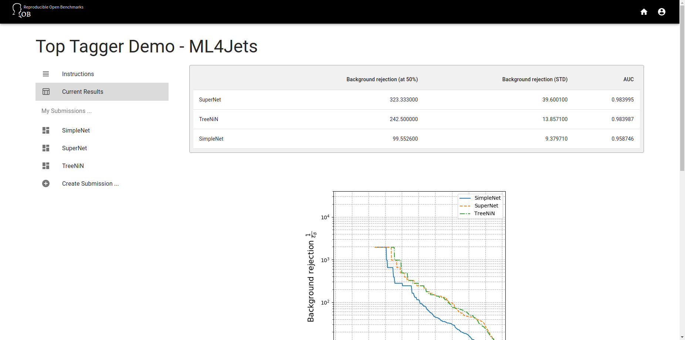
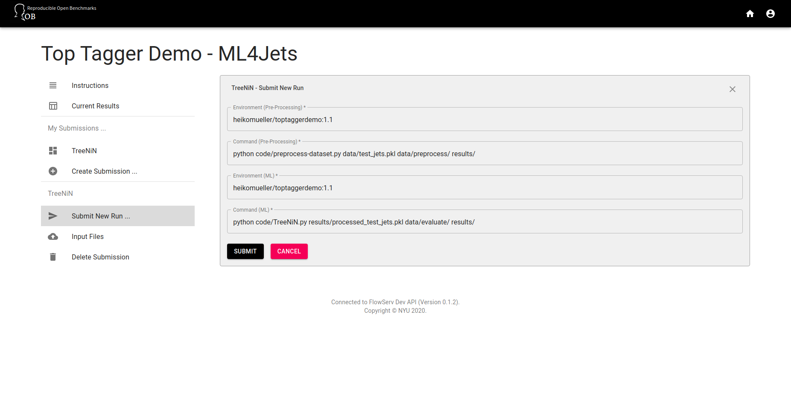
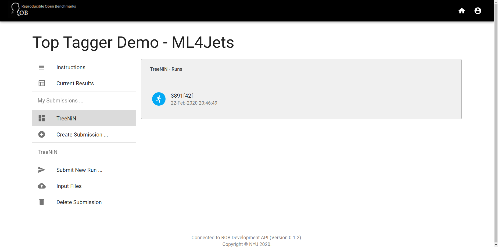
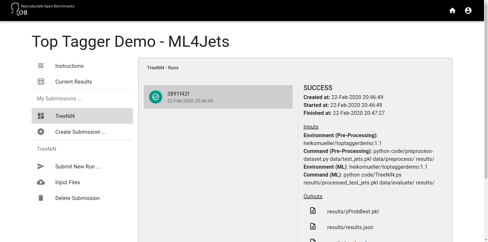

## About

The is the Web-based user interface for the *Reproducible Open Benchmarks for Data Analysis Platform (ROB)*.

This project was bootstrapped with [Create React App](https://github.com/facebook/create-react-app). You can find more information about the available scripts on our copy of the [Create React App README](https://github.com/heikomuller/rob-ui/docs/development.md).

## Getting Started

The Web application requires an instance of the [ROB Web Service](https://github.com/scailfin/rob-webapi-flask/). You can follow the instructions on the [Flask Web API - Demo Setup site](https://github.com/scailfin/rob-webapi-flask/blob/master/docs/demo-setup.rst) to setup and run the Web API.

To start the development server use `yarn start`. Note that this is a very preliminary version of the user interface. The application currently assumes that the ROB Web Services is accessible at the local URL `http://localhost:5000/rob/api/v1`.

## User Interface Features

Below are screen shots that show some of the main activities that are currently supported by the user interface.

### ROB Home Page

### Benchmark Overview

### Current Benchmark Results

### Start New Benchmark Run

### Running Benchmark Status

### Successful Benchmark Run

